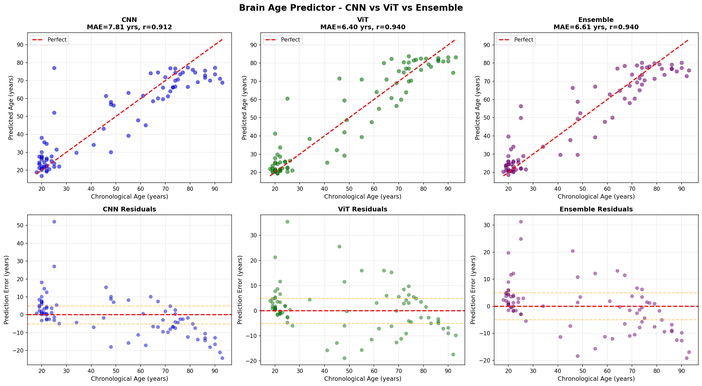
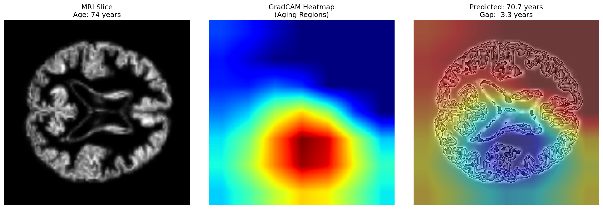

# Brain-Age-Gap

### Brain Age Prediction with Vision Transformers, CNNs, and Explainable AI

Deep learning pipeline for biological brain age prediction from structural MRI scans using CNNs and Vision Transformers, combined with GradCAM-based interpretability and structured inference reporting.

---

## Overview

Brain aging patterns visible in structural MRI scans can provide important biomarkers for neurodegenerative disorders such as Alzheimer's Disease and Mild Cognitive Impairment (MCI).

This project predicts **biological brain age** from MRI slices and computes:

```math
Brain\ Age\ Gap = Predicted\ Age - Chronological\ Age
```

A positive Brain Age Gap may indicate accelerated neurodegeneration, while negative values may reflect healthier-than-expected aging.

The project compares:

* Convolutional Neural Networks (CNNs)
* Vision Transformers (ViTs)
* Ensemble predictions

while also generating explainability heatmaps using GradCAM.

---

# Features

* MRI-based brain age prediction
* CNN and Vision Transformer backbones
* Brain Age Gap biomarker computation
* GradCAM explainability maps
* Residual and error analysis
* Model benchmarking and comparison
* NIfTI MRI inference pipeline
* Structured prediction reporting

---

# Dataset

Dataset used:

* **OASIS-3** longitudinal neuroimaging dataset

MRI modality:

* Structural T1-weighted MRI scans

Preprocessing includes:

* Slice extraction
* Intensity normalization
* Resizing
* Tensor conversion

---

# Repository Structure

```bash
Brain-Age-Gap/
│
├── models/                     # CNN and ViT architectures
├── utils/                      # Utility functions and preprocessing
│
├── data_preparation.py         # MRI preprocessing pipeline
├── train_cnn.py                # CNN training
├── train_vit.py                # Vision Transformer training
├── compare_models.py           # Model benchmarking and evaluation
├── inference.py                # End-to-end inference pipeline
├── monitor_training.py         # Training monitoring utilities
│
├── assets/                     # Images, diagrams, GradCAM outputs
├── outputs/                    # Prediction outputs and reports
│
├── requirements.txt
└── README.md
```

---

# Model Architectures

## CNN Baseline

A convolutional neural network trained on 2D MRI slices to establish baseline performance for brain age regression.

## Vision Transformer (ViT)

A transformer-based architecture leveraging patch embeddings and self-attention mechanisms for improved global feature learning across neuroanatomical structures.

## Ensemble

Weighted combination of CNN and ViT predictions for comparative analysis.

---

# Results

| Model    | MAE (years) | Correlation (r) |
| -------- | ----------- | --------------- |
| CNN      | 7.81        | 0.912           |
| ViT      | 6.40        | 0.940           |
| Ensemble | 6.61        | 0.940           |

The Vision Transformer achieved the best overall performance with lower prediction error and stronger correlation with chronological age.

---

# Model Comparison



The residual analysis highlights:

* larger prediction variance in CNN baselines
* tighter residual distribution for ViT
* reduced systematic bias in transformer-based models

---

# Explainability with GradCAM

GradCAM attribution maps were generated to identify regions contributing most strongly to age prediction.

Highlighted regions frequently aligned with known neuroanatomical aging areas including:

* hippocampal regions
* cortical atrophy zones
* ventricular enlargement patterns



---

# Inference Pipeline

The inference pipeline:

1. Loads MRI scans in NIfTI format
2. Extracts valid slices
3. Performs preprocessing
4. Runs trained model inference
5. Computes Brain Age Gap
6. Generates GradCAM heatmaps
7. Produces structured prediction outputs

---

# Example Output

```text
Chronological Age: 74 years
Predicted Brain Age: 70.7 years
Brain Age Gap: -3.3 years
```

---

# Running Training

## CNN Training

```bash
python train_cnn.py
```

## Vision Transformer Training

```bash
python train_vit.py
```

---

# Running Inference

```bash
python inference.py --input sample_scan.nii.gz
```

---

# Evaluation Metrics

The project evaluates:

* Mean Absolute Error (MAE)
* Pearson Correlation
* Residual distributions
* Error trends across age groups

Residual analysis was used to detect:

* systematic prediction bias
* variance across age ranges
* generalization quality

---

# Challenges Faced

Some major challenges during development included:

* handling variability across MRI slices
* preventing overfitting on limited neuroimaging data
* improving transformer generalization
* generating anatomically meaningful GradCAM visualizations
* balancing interpretability with predictive performance

---

# Future Improvements

Potential future extensions include:

* 3D MRI modeling
* longitudinal trajectory prediction
* uncertainty quantification
* conformal prediction intervals
* multimodal neuroimaging integration
* clinically calibrated risk scoring

---

# Technical Stack

## Deep Learning

* PyTorch
* Vision Transformers
* CNNs

## Neuroimaging

* nibabel
* nilearn
* NIfTI MRI processing

## Explainability

* GradCAM
* Attribution visualization

## Visualization

* Matplotlib
* NumPy
* Pandas

---

# Clinical Motivation

Brain Age Gap prediction has emerged as an important research direction for studying:

* healthy aging
* Alzheimer's Disease
* Mild Cognitive Impairment
* neurodegenerative progression

This project focuses not only on predictive performance, but also on interpretability and clinically meaningful analysis.

---

# Author

Shipra Pathak

Clinical AI | Neuroimaging AI | Explainable ML | LLM Systems

GitHub: https://github.com/shipra1611
